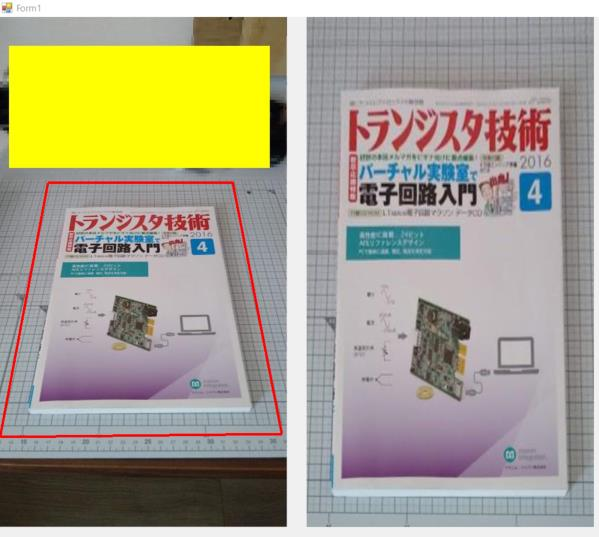

# Projection-transformation

## 概要 (Overview)

C#による台形補正（射影変換）サンプル

対象物に対して台形補正を行い、背景を最大に残す改良を実施

## 画面イメージ (ScreenShot)

## 動作要件 (Requirements)

C# および

NuGetでインストールできる 
・OpenCvSharp4 
・OpenCvSharp4.runtime.win 
・OpenCvSharp4.Windows 
・OpenCvSharp4.WpfExtensions

## 技術的解説 (Technical explanation)
https://s51517765.hatenadiary.jp/entry/2021/08/09/073000

## ライセンス (License)

This software is released under the MIT License, see LICENSE.
